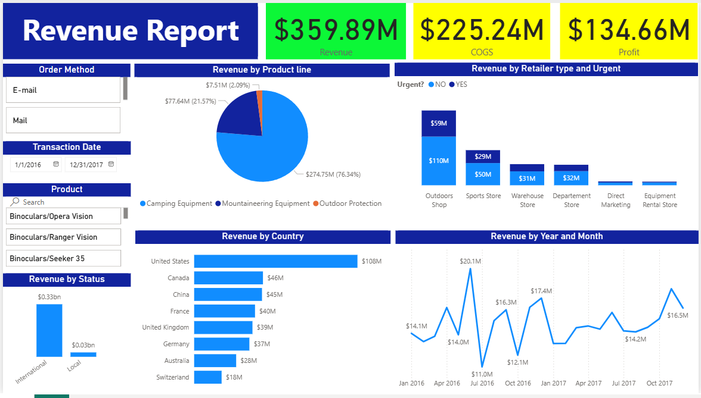

# Sales Revenue Dashboard with Power BI


An interactive **Power BI** dashboard analyzing global sales performance from 2016 to 2017, covering revenue, COGS, profit, and sales distribution across products, countries, and retailer types.

---

## Dashboard Preview



---

## Key Metrics

| Metric | Value |
|--------|-------|
| Total Revenue | **$359.89M** |
| COGS | **$225.24M** |
| Profit | **$134.66M** |
| Period | Jan 2016 – Dec 2017 |

---

## Repository Structure

```
sales-revenue-dashboard/
│
├── data/
│   └── Sales_Data_Set.xlsx       
│
├── assets/
│   └── dashboard-preview.png     
│
├── docs/
│   └── data-dictionary.md
│
├── Sales_Revenue_Dashboard.pbix
└── README.md
```

> **Note:** The dataset has been re-modeled and modified to fit the Power BI data schema. It may differ from the original raw source.

---

## Dashboard Features

- **Revenue by Product Line**:Pie chart showing revenue share across product categories (Camping Equipment, Mountaineering Equipment, Outdoor Protection)
- **Revenue by Country**: Horizontal bar chart of top countries by revenue
- **Revenue by Retailer Type & Urgency**: Stacked bar comparing urgent vs. non-urgent orders across retailer types
- **Revenue Trend (Year & Month)**: Monthly revenue line chart for 2016–2017
- **Revenue by Status**: International vs. Local sales breakdown
- **Interactive Filters**: Order Method slicer, Transaction Date range, and Product search

---

## Data Source

The dataset consists of **3 tables** inside `Sales_Data_Set.xlsx`, re-modeled for Power BI:

| Table | Description | Records |
|-------|-------------|---------|
| `Sales Table` | Daily sales transactions | ~7,500 rows |
| `Country Table` | Country and city mapping | 34 rows |
| `Product Table` | Product codes, product lines, and cost | 118 rows |

**Key columns in Sales Table:**
`Trans Date` · `RetCity` · `Order Method Type` · `Urgent?` · `Retailer Type` · `Product Code` · `Value` · `Quantity Sold`

---

## Key Insights

- **Camping Equipment** dominates revenue at **76.34%** ($274.75M)
- **United States** is the largest market with **$108M** in revenue
- **Outdoors Shop** leads all retailer types with $110M (non-urgent) + $59M (urgent)
- Revenue peaked in **July 2016** at $20.1M
- **International** sales significantly outpace Local ($0.33bn vs $0.03bn)

---

## Tools & Technologies

- **Power BI Desktop** for data modeling, DAX measures, and dashboard design
- **Microsoft Excel** for source data
- **DAX** for custom measures and KPI calculations

---

## Disclaimer

This project is built for portfolio and learning purposes. The dataset comes from one of the courses on Udemy.

---

## Author

Yan Andhinaya Ardika
- GitHub: [yandik](https://github.com/yanardika)
---
