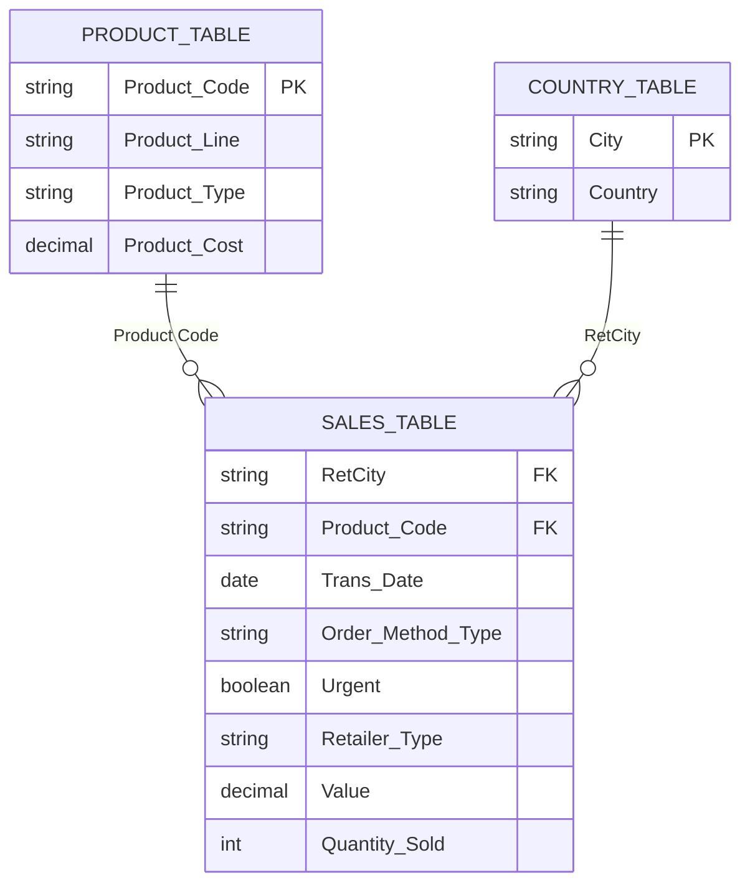

# Data Dictionary

This document describes the structure and column definitions of `Sales_Data_Set.xlsx`.

> The dataset has been re-modeled and partially modified for use in Power BI. Some columns may have been renamed, cleaned, or restructured from the original source.

---

## Table 1: Sales Table (7,524 rows)

Contains daily sales transaction records for the period 2016–2017.

| Column | Data Type | Description |
|--------|-----------|-------------|
| `Trans Date` | Date | Transaction date |
| `RetCity` | Text | Retailer city where the transaction occurred |
| `Order Method Type` | Text | How the order was placed (e.g., E-mail, Mail) |
| `Urgent?` | Boolean | Whether the order was flagged as urgent (YES / NO) |
| `Retailer Type` | Text | Category of retailer (Outdoors Shop, Sports Store, Warehouse Store, Department Store, Direct Marketing, Equipment Rental Store) |
| `Product Code` | Text | Unique product identifier with foreign key to Product Table |
| `Value` | Decimal | Transaction revenue value ($) |
| `Quantity Sold` | Integer | Number of units sold |

---

## Table 2: Country Table (34 rows)

Maps city names to their respective countries.

| Column | Data Type | Description |
|--------|-----------|-------------|
| `Country` | Text | Country name |
| `City` | Text | City within that country |

**Countries included:** United States, Canada, China, France, United Kingdom, Germany, Australia, Switzerland, and more.

---

## Table 3: Product Table (118 rows)

Contains product details including product line classification and cost.

| Column | Data Type | Description |
|--------|-----------|-------------|
| `Product Code` | Text | Unique product identifier (Primary Key) |
| `Product Line` | Text | Top-level product category |
| `Product Type / Product` | Text | Specific product type and name |
| `Product Cost` | Decimal | Cost of goods per unit (used for COGS calculation) |

**Product Lines:**
- **Camping Equipment**
- **Mountaineering Equipment**
- **Outdoor Protection**

---

## Table Relationships

---

## Notes

- Data covers the period January 1, 2016 – December 31, 2017
- The `Value` column in Sales Table represents total transaction revenue (not unit price)
- COGS is derived from `Product Cost × Quantity Sold` via the Product Table relationship
- This dataset is simulated and intended for portfolio and analytical purposes only
